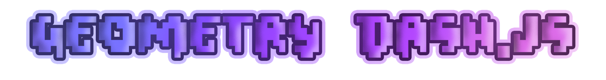

geometry-dash.js is an [npm](https://www.npmjs.com/) library which you can use to interact easily with [Geometry Dash's](https://www.robtopgames.com/) servers. People is not meant to access this servers, but with some reverse ingeneering, we can get access to them to recieve and post data.

# Instalation

```cmd
npm install geometry-dash.js
yarn add geometry-dash.js
```

# Links

 - [Discord](https://discord.gg/g9dcNqGkzd)